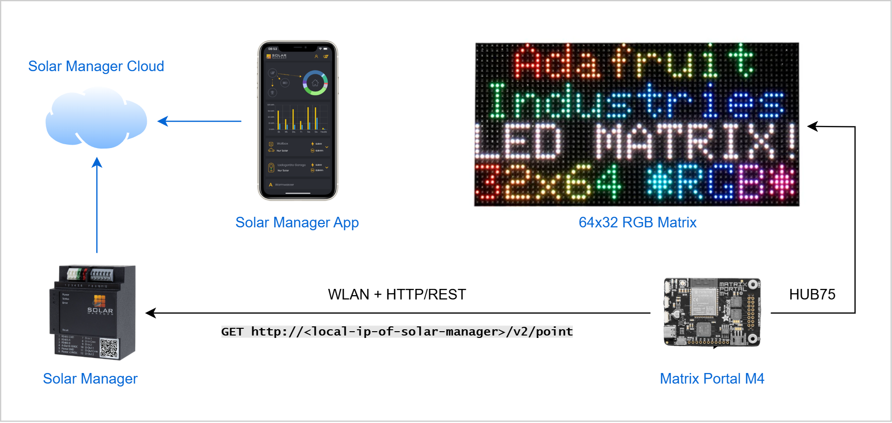
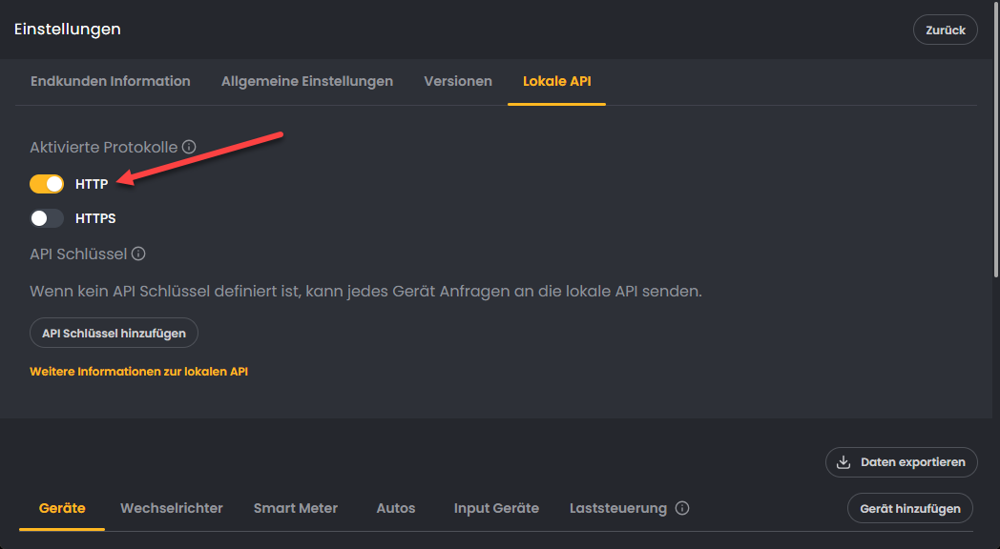

# 🌞 Matrix Display for Solar Manager

This repo contains the firmware for a compact LED display based on the [Adafruit Matrix Portal M4 with a 64×32 RGB matrix](https://www.adafruit.com/product/4812).

The display shows live energy data from the [Solar Manager](https://www.solarmanager.ch/), an edge device that optimizes solar self-consumption, helping you use as much of your own generated solar power as possible. A concept that is currently very popular in Switzerland.

This README focuses solely on the firmware and how to run it on the microcontroller. Information about the Solar Manager and the overall project is documented separately (in German) on the following GitHub Pages site:

👉 **[philippbruhin.github.io/solar-manager-matrix-display](http://philippbruhin.github.io/solar-manager-matrix-display)**

The display provides an at-a-glance visualization of key energy metrics:

- 🏠 **House consumption**
- ☀️ **Solar generation**
- 🔋 **Battery state of charge**
- 🚿 **Hot water temperature**


## 🧱 Hardware Used

The hardware setup follows a simple, fully local data flow:

- The **Solar Manager** exposes live measurement data via a REST API on the local network:  
  `GET http://<local-ip-of-solar-manager>/v2/point`
- The **Matrix Portal M4** connects via WLAN, polls this API, and drives the **64×32 RGB LED matrix** through the HUB75 interface.
- Separately, the Solar Manager sends system data outbound to the **Solar Manager Cloud**, which powers the official mobile app and the [web client](https://web.solar-manager.ch/login).



Although Solar Manager also provides a **Cloud API**, this project intentionally uses the **local HTTP API** for maximum simplicity, lower latency, and improved privacy/security.

I purchased the [Adafruit Matrix Portal Starter Kit](https://www.adafruit.com/product/4812) through [DigiKey Switzerland](https://www.digikey.ch/en/products/detail/adafruit-industries-llc/4812/15189153) for around CHF 60.00 including shipping. The kit includes everything needed:

| Component | Description | Link |
|----------|-------------|------|
| **Adafruit Matrix Portal M4** | Main controller board (SAMD51 + ESP32 for Wi-Fi) | [Adafruit Product 4812](https://www.adafruit.com/product/4812) |
| **64×32 RGB LED Matrix (HUB75)** | RGB LED panel with 32×64 pixels and 4 mm pitch | [Adafruit Product 2278](https://www.adafruit.com/product/2278) |
| **USB-C cable and power supply** | Provides power for the display. Included in the kit, but the charger comes with a **US plug**, so it cannot be used directly in Switzerland. | [Adafruit Product 1995](https://www.adafruit.com/product/1995) |

> The store links above are **not affiliated** or sponsored. They are simply where I purchased the hardware.

## 📡 Data Collection

Make sure you enable the **local API** at [web.solar-manager.ch/my-devices/](https://web.solar-manager.ch/my-devices/) so that the display can retrieve data directly from your Solar Manager gateway.



Because the display operates **only inside your local network**, this project keeps things simple and does not use encryption or authentication. Communication is done via plain **HTTP** and **no API key** is required.

## 🛠 Recommended Development Environment

The official [Adafruit Learning Portal](https://learn.adafruit.com/adafruit-matrixportal-m4/) often recommends using the **[Mu Editor](https://codewith.mu/)** for CircuitPython. However, Mu is no longer actively developed, and I personally prefer working with **[Visual Studio Code](https://code.visualstudio.com/)**.

VS Code works extremely well with CircuitPython. For debugging, it is highly recommended to install the **Serial Monitor** extension:

🔌 **VS Code Serial Monitor:**  
https://marketplace.visualstudio.com/items?itemName=ms-vscode.vscode-serial-monitor

This extension lets you view print output, errors, and debug messages directly from the Matrix Portal M4, which is extremely helpful when troubleshooting Wi-Fi issues, API calls, or display updates.

Below is an example of the Serial Monitor in VS Code:


## 🧰 Firmware & Library Setup

Once the display and the microcontroller are connected and wired, follow these steps to install the firmware on your Matrix Portal M4.

### 1. Update the CircuitPython Firmware (do this first)

1. Connect the Matrix Portal M4 to your computer via **USB-C**. It will appear as a drive named `MATRIXBOOT`.
2. This project was developed and tested using **CircuitPython 10.x**. For best compatibility, download the **CircuitPython 10 .UF2 file** from: https://circuitpython.org/board/matrixportal_m4/
3. Drag and drop the `.uf2` file onto the `MATRIXBOOT` drive.  
   The board will reboot automatically and reappear as `CIRCUITPY`.

ℹ️ Updating the ESP32 Wi-Fi firmware is **strongly recommended**. With the firmware that ships on some boards, Wi-Fi may not work reliably or may not connect at all. The update process is simple and can be completed directly in your web browser:

🔗 https://learn.adafruit.com/upgrading-esp32-firmware/upgrade-all-in-one-esp32-airlift-firmware

### 2. CircuitPython Libraries

This project uses the **Adafruit CircuitPython Bundle v10.x**,  
and all required libraries are already included in the `/lib` folder of this repository.

You can check the contents here: [CIRCUITPY/lib](./CIRCUITPY/lib/). This means you **don’t need to install anything manually**.

However, if you want to extend the display or plan to use a newer CircuitPython version, you can download the latest library bundle here:

👉 https://circuitpython.org/libraries

Unzip the bundle and copy only the libraries you actually need into the `/lib` folder on the `CIRCUITPY` drive. Microcontroller storage is limited, so avoid copying the entire bundle.

## 📁 Project file overview

Everything inside the `CIRCUITPY` folder is relevant for the microcontroller.

```
CIRCUITPY/
│
├── code.py
├── config.py
├── ui.py
├── helpers.py
│
├── assets/
│   ├── icon-battery-empty.bmp
│   ├── icon-battery-full.bmp
│   ├── icon-house.bmp
│   ├── icon-shower.bmp
│   ├── icon-sun.bmp
│
├── settings.toml   ← created by you, not in repo
├── settings.example.toml
│
└── lib/            ← CircuitPython libraries

```

| File / Folder             | Purpose                      | Notes                                                         |
| ------------------------- | ---------------------------- | ------------------------------------------------------------- |
| **code.py**               | Main application entry point | Starts Wi-Fi, fetches Solar Manager data, updates the display |
| **config.py**             | Configuration values         | Colors, layout positions, refresh intervals, display settings |
| **ui.py**                 | User interface rendering     | Loads icons, draws text, builds the display group             |
| **helpers.py**            | Utility functions            | Value formatting, number helpers, safe parsing                |
| **assets/**               | Bitmap icons used in UI      | `.bmp` files for solar, house, battery, boiler, etc.          |
| **settings.toml**         | Your private configuration   | Wi-Fi credentials + Solar Manager API URL (**not in repo**)   |
| **settings.example.toml** | Template for settings        | Copy to `settings.toml` and fill your values                  |
| **lib/**                  | CircuitPython libraries      | Needed by the Matrix Portal (bundled in repo)                 |

## ⚙️ Configuration and running the device

Perform following steps to run the display.

1. Copy **all files and folders** from the `CIRCUITPY/` directory in this repository directly onto your local `CIRCUITPY` drive on the Matrix Portal M4.
2. Rename the file `settings.example.toml` to **`settings.toml`**.
3. Open `settings.toml` and enter your own configuration values:

   ```toml
   WIFI_SSID = "YourNetworkName"
   WIFI_PASSWORD = "YourWifiPassword"
   SOLAR_MANAGER_LOCAL_API_BASE_URL = "http://<your-local-solar-manager-ip>/v2/point"
   SOLAR_MANAGER_DEVICE_TEMP_ID = "68f..."
   ```

CircuitPython does **not** require compilation; instead, the code runs directly. As soon as the files are copied, the board will:

1. Reboot automatically  
2. Connect to the Wi-Fi network you configured in `settings.toml`,  
   showing a marquee with the SSID it connects to and the IP address it receives via DHCP  
3. Fetch Solar Manager data and start updating the display


## 💬 Feedback & Improvements

This project is a hobby setup and there is certainly a lot that can be improved, optimized, or extended. I’m happy about any kind of feedback, suggestions, or contributions.

Have fun building, modifying, and improving your own Solar Manager Matrix Display! ⚡🔧😄
