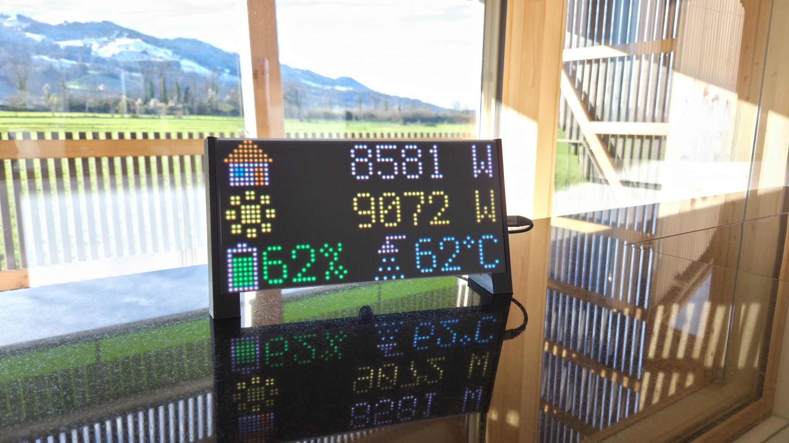

Diese Seite beschreibt den Eigenbau eines kostengünstigen, lokal betriebenen und langlebigen LED-Displays mit 2'048 Pixeln für den [Solar Manager](https://www.solarmanager.ch/).

Die Firmware – also die Software, die auf dem Microcontroller des Displays läuft – ist im folgenden GitHub-Repository abgelegt und in englischer Sprache dokumentiert:

🔗 **[GitHub-Repository des Projekts](https://github.com/philippbruhin/solar-manager-matrix-display/)**

Diese Webseite erläutert ergänzend die Hintergründe, Entscheidungen und den praktischen Aufbau.

Das Projekt richtet sich an technisch Interessierte, die das Display nachbauen oder erweitern möchten. Programmierkenntnisse sind **nicht zwingend erforderlich**. Wichtig ist vor allem Interesse an Python, Microcontrollern und einem grundlegenden Verständnis von TCP/IP-Netzwerken.

Die Firmware wird in **Python** geschrieben, einer einsteigerfreundlichen und weit verbreiteten Programmiersprache. Beim Nachbauen lernt man eine Menge über Microcontroller, APIs, Netzwerkkommunikation Python-Programmierung und 3D-Druck (der Displayhalter wurde ebenfalls selbst konstruiert).

## Ausgangslage

Im Herbst 2025 konnten wir auf unserem Hausdach eine Solaranlage installieren. Gesteuert wird die Anlage durch den [Solar Manager](https://www.solarmanager.ch/) der Solar Manager AG.

Der Solar Manager ist ein Edge-Computer, der den **Eigenverbrauch optimiert** und dafür sorgt, dass möglichst viel des selbst produzierten Solarstroms direkt im Haushalt genutzt wird. Das System überzeugt, weil es sowohl für Anwender gedacht ist, die „einfach möchten, dass alles funktioniert“, als auch für Bastler, die ihren Energiefluss detailliert analysieren und optimieren möchten. Zudem ist man nicht an einen Hersteller gebunden. Der Solar Manager kann Geräte unterschiedlichster Marken steuern.

In meinem Setup sind unter anderem eine **Hoval-Wärmepumpe**, eine **Zaptec-Ladestation**, ein **Huawei Wechselrichter sowie ein Batteriespeicher**, eine **Boilerheizung** sowie zwei **Entfeuchtungsgeräte** und eine **Warmwasserbegleitheizung** integriert. Die Offenheit des Systems erlaubt es, diese sehr unterschiedlichen Komponenten ohne grossen Aufwand einzubinden.

Die App und das Webportal des Solar Managers bieten bereits umfangreiche Informationen. Für den Wohnbereich wünschte ich mir jedoch eine **stets sichtbare, bewusst reduzierte und fest installierte Anzeige**, die ohne Interaktion auskommt und nur die wichtigsten Werte zeigt.

Natürlich gibt es bereits bestehende Lösungen wie etwa [Tablet-basierte Anzeigen](https://www.solarmanager.ch/tabletkonfiguration/) oder fertige [LED-Displays](https://www.solarmanager.ch/solarleistung-via-solar-manager-auf-smart-displays-anzeigen), von denen mindestens eines bei bekannten Schweizer Online-Händlern erhältlich ist. Diese funktionieren zwar gut, lassen sich jedoch nur eingeschränkt an eigene Bedürfnisse anpassen.

Genau deshalb entstand die Idee für einen **Eigenbau**, der maximale Flexibilität bietet und die Anzeige exakt so darstellt, wie man sie im Alltag benötigt.

## Hardwarewahl

Für das Projekt kommt ein LED-Matrix-Set von Adafruit zum Einsatz. LED-Matrix-Displays haben für mich eine angenehm nostalgische Anmutung. Gleichzeitig schätze ich ihre klare, reduzierte Darstellung. Sie sind preiswert, stromsparend, robust und daher ideal für eine dauerhaft sichtbare Statusanzeige.

Das Set von Hersteller Adafruit besteht aus einem **64×32-Pixel RGB-LED-Panel** (2'048 LEDs) und einem dazugehörigen **RGB Matrix Bonnet** (Aufsteckplatine).

* Link zur Hersteller-Webseite: [www.adafruit.com/product/4812](https://www.adafruit.com/product/4812)  
* Gekauft habe ich das Set über DigiKey: [www.digikey.ch/de/products/detail/adafruit-industries-llc/4812/15189153](https://www.digikey.ch/de/products/detail/adafruit-industries-llc/4812/15189153)  
  Preis inkl. Versand: CHF 60.

Das Set enthält **alles, was man für den Betrieb benötigt**: Das LED-Panel, das Matrix Bonnet (bzw. Matrix Portal M4), alle notwendigen Stecker sowie die Elektronik zur direkten Ansteuerung des Displays. Lediglich das mitgelieferte USB-C-Netzteil besitzt einen **US-Stecker** und muss daher durch ein CH-Modell ersetzt oder mit einem Adapter betrieben werden.

### Aufbau des Controllers (Adafruit Matrix Portal M4)

Das Controllerboard kombiniert zwei Mikrocontroller:

* **SAMD51** – der Hauptcontroller, auf dem die eigentliche Firmware läuft. Er steuert das LED-Panel präzise an und führt den Python-Code aus.

* **ESP32** – sorgt für WLAN-Konnektivität. In CircuitPython wird der ESP32 als „Co-Prozessor“ genutzt, der sich um die Netzwerkverbindung kümmert.

Über USB-C erscheint das Gerät wie ein normales USB-Laufwerk. Man kopiert einfach den Python-Code auf das Board. Keine zusätzliche Software oder Entwicklungsumgebung erforderlich.

## Programmierung

Das Set kann sowohl in **C (Arduino)** als auch in **Python (CircuitPython)** programmiert werden. Ich habe mich für CircuitPython entschieden, weil es:

* sehr einfach zu verwenden ist  
* keine Toolchains benötigt  
* sofort ausgeführt wird, ohne Kompilierung  
* ideal für REST-APIs und einfache Logik ist  

Der vollständige Quellcode befindet sich im Projekt-Repository <https://github.com/philippbruhin/solar-manager-matrix-display/> im Unterordner `CIRCUITPY`.

Das Programm ist bewusst schlank gehalten und besteht aus nur fünf Python-Dateien.

# Funktionsweise des Displays

Das Display stellt vier Werte gleichzeitig dar. Die 10×10-Pixel-Icons wurden mit [pixilart.com](https://www.pixilart.com/philippb/gallery) erstellt.

* 🏠 **Hausverbrauch**  
* ☀️ **Solarproduktion**  
* 🔋 **Batteriestatus**  
* 🚿 **Boiler-Temperatur**

Die Werte werden einmal pro Minute über die **lokale REST-API** des Solar Managers abgerufen. Da die Abfrage vollständig lokal erfolgt, ist keine Authentifizierung notwendig und das Display ist nicht mit dem Internet verbunden.

Grundsätzlich könnte man die Daten auch per WebSocket übertragen. Dabei würden Aktualisierungen in Echtzeit erfolgen, also sofort, sobald sich ein Wert ändert. Für dieses Projekt verzichte ich bewusst darauf, um eine ruhige und stabile Anzeige ohne ständige Wechsel zu erreichen.

# Gehäuse und Montage

Für das Display wurde ein passender Halter in **Fusion 360** modelliert. Fusiion ist eine CAD Software, welche kostenlos genutzt werden darf für den privaten Gebrauch. Unterstützung bei Konstruktion und 3D-Druck erhielt ich von [Ibex3D GmbH](https://ibex3d.ch/).

Das Modell kann im folgenden Viewer betrachtet werden. Es lässt sich entweder selbst ausdrucken ([`f3z` Datei Download](./assets/Matrix_Display_Frame_V5.f3z)) oder direkt bei der Ibex 3D GmbH bestellen.

  <iframe 
    src="https://philippbruhin.autodesk360.com/shares/public/SH90d2dQT28d5b60281194915078e9b8702a?mode=embed"
    allowfullscreen
    frameborder="0">
  </iframe>

# Fazit

Dieses Projekt bietet eine einfache Vorlage für eine **lokale und jederzeit sichtbare Anzeige** des Solar Managers. Die Lösung ist **kostengünstig**, **nachvollziehbar** und arbeitet im Alltag stabil.

Eine kleine Einschränkung betrifft die **Helligkeit** des Panels: Obwohl CircuitPython Werte zwischen `0` und `1` erlaubt, reagiert das Display in der Praxis nur mit wenigen Abstufungen. Im Wesentlichen eigentlich nur mit „aus“ oder „volle Helligkeit“. Für den Einsatz tagsüber ist das völlig ausreichend, in der Nacht hätte ich mir jedoch eine etwas feinere Dimmung gewünscht.

Abgesehen davon ist das Projekt sehr **flexibel und erweiterbar**. Beliebige zusätzliche Messwerte können integriert werden, und dank CircuitPython lässt sich der Code leicht verstehen und an individuelle Bedürfnisse anpassen.

Ich freue mich über **Feedback, Hinweise, Ideen oder Pull Requests**. Viel Spass beim Nachbauen und Weiterentwickeln! 🚀🔧☀️
