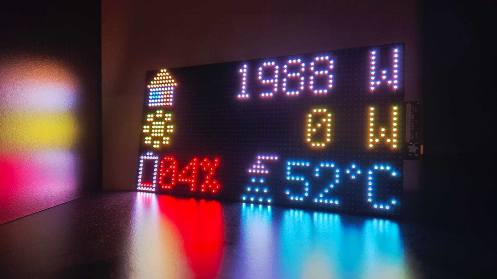

Diese Seite beschreibt den Eigenbau eines kostengünstigen, lokal betriebenen und langlebigen Displays mit 2'048 LEDs für den [Solar Manager](https://www.solarmanager.ch/).

Die Firmware – also die Software, die auf dem Microcontroller für das LED-Matrix-Display (64 × 32 LEDs, 4 mm Pitch) läuft, ist im [GitHub-Repository des Projekts](https://github.com/philippbruhin/solar-manager-matrix-display/) in englischer Sprache dokumentiert. Diese Webseite erläutert ergänzend die Hintergründe, Entscheidungen und den Aufbau.

Das Projekt richtet sich an technisch Interessierte, die das Display nachbauen und nach eigenen Bedürfnissen erweitern möchten. Grundlegendes Interesse am Programmieren ist hilfreich, jedoch sind **Vorkenntnisse nicht zwingend erforderlich**. Die Firmware wird in **Python** geschrieben, welche eine der einsteigerfreundlichsten und am weitesten verbreiteten Programmiersprachen ist.

# Ausgangslage

Im Herbst 2025 hatten wir das Privileg, auf unserem Hausdach eine Solaranlage installieren zu lassen. Gesteuert wird die Anlage durch den [Solar Manager](https://www.solarmanager.ch/) der Solar Manager AG.  

Der Solar Manager ist ein Edge-Computer, der den Eigenverbrauch optimiert und dafür sorgt, dass möglichst viel des selbst produzierten Solarstroms direkt im Haushalt genutzt wird. Mich überzeugt das System, weil es sowohl für Anwender geeignet ist, die „einfach möchten, dass alles reibungslos läuft“, als auch für Bastler, die ihren Eigenverbrauch bis ins Detail optimieren möchten. Zudem ist man nicht an einen Hersteller gebunden, der Solar Manager kann Geräte der unterschiedlichsten Marken steuern.

In meinem Setup sind unter anderem eine Hoval-Wärmepumpe, eine Zaptec-Ladestation, ein Huawei-Batteriespeicher, eine Boilerheizung sowie eine Entfeuchtungsanlage über Shelly-Geräte integriert. Die Offenheit des Systems erlaubt es, diese sehr unterschiedlichen Komponenten ohne grossen Aufwand einzubinden.

Die App und das Webportal des Solar Managers bieten bereits umfassende Informationen. Für den Wohnbereich wünschte ich mir jedoch eine **stets sichtbare, bewusst reduzierte und fest installierte Anzeige**, die ohne jegliche Interaktion auskommt und nur die wichtigsten Werte zeigt.

Natürlich existieren dafür bereits Lösungen, die auf der Webseite des Solar Managers dokumentiert sind. Etwa eine [Tablet-basierte Anzeige](https://www.solarmanager.ch/tabletkonfiguration/) oder zwei [LED-Displays](https://www.solarmanager.ch/solarleistung-via-solar-manager-auf-smart-displays-anzeigen), von denen eines beim Universal-Online-Shop Ihres vertrauens bestellt werden kann.

Diese Lösungen sind funktional. Sie lassen sich jedoch nur begrenzt anpassen. Genau hier entstand die Idee für einen **Eigenbau**, der maximale Flexibilität bietet und die Anzeige exakt so darstellt, wie man sie im Alltag benötigt.

# Motivation für einen Eigenbau

LED-Matrix-Displays haben für mich etwas Angenehm-Nostalgisches. Gleichzeitig schätze ich ihre klare und reduzierte Art, Informationen darzustellen. Sie sind zudem preiswert, stromsparend und technisch langlebig. Daher war für mich von Anfang an klar, dass eine LED-Lösung einer Tablet-Lösung vorzuziehen ist.

Wie oben beschrieben, existieren zwar bereits fertige oder Plug-and-Play-Lösungen. Diese decken jedoch meist nur Standardwerte ab und bieten nur begrenzte Anpassungsmöglichkeiten.

Ein Eigenbau wie dieser bietet hingegen **volle Kontrolle über die angezeigten Daten**. So lassen sich etwa darstellen:

* Ladezustand des Hausakkus  
* Ladezustand eines oder mehrerer Elektroautos  
* Boiler-Temperatur  
* Raumtemperaturen  
* Status einzelner Verbraucher  
* beliebige weitere Messwerte

Damit lässt sich die Anzeige exakt auf die eigenen Bedürfnisse abstimmen. Ganz nebenbei lernt man dabei auch noch vieles dazu, etwa die Programmierung eines Microcontrollers in Python oder das Konstruieren von 3D-Druckteilen wie dem benötigten Displayhalter.

# Zielsetzung

Für das Projekt wurden folgende Ziele definiert:

* Gesamtkosten von maximal CHF 100  
* Alle wichtigen Werte gleichzeitig sichtbar (ohne Laufschrift oder sichtbaren Umsprung)  
* Aktualisierung nur einmal pro Minute für eine ruhige, stabile Darstellung  
* Einfache und langlebige Programmierung  
* Vollständig lokaler Betrieb ohne Internetverbindung

# Hardwarewahl

Für das Projekt kommt ein LED-Matrix-Set von Adafruit zum Einsatz. Es besteht aus einem **64×32-Pixel RGB-LED-Panel** (2'048 LEDs) und einem dazugehörigen **RGB Matrix Bonnet** (Aufsteckplatine). Das Panel ist ein sogenanntes **1/16-Scan- oder „1/16 Duty“-Display**, häufig als „HUB75-Display“ bezeichnet. Solche Panels werden typischerweise für Anzeigetafeln oder Informationsdisplays verwendet: Sie sind sehr hell, robust, modular aufgebaut und bieten hervorragende Darstellung bei geringem Stromverbrauch.

* Adafruit RGB Matrix Bonnet + 64×32-Pixel LED-Panel  
  Link zur Hersteller-Webseite: [www.adafruit.com/product/4812](https://www.adafruit.com/product/4812)  
* Gekauft habe ich das Set über DigiKey: [www.digikey.ch/de/products/detail/adafruit-industries-llc/4812/15189153](https://www.digikey.ch/de/products/detail/adafruit-industries-llc/4812/15189153)  
  Preis inkl. Versand: CHF 60.

Das Set enthält **alles, was man für den Betrieb benötigt**: Das LED-Panel, das Matrix Bonnet (bzw. Matrix Portal M4), alle notwendigen Stecker sowie die Elektronik zur direkten Ansteuerung des Displays. Lediglich das mitgelieferte USB-C-Netzteil besitzt einen **US-Stecker** und muss daher durch ein CH-Modell ersetzt oder mit einem Adapter betrieben werden.

## Aufbau des Controllers (Adafruit Matrix Portal M4)

Das Controllerboard kombiniert zwei Mikrocontroller:

* **SAMD51** – der Hauptcontroller, auf dem die eigentliche Firmware läuft. Er steuert das LED-Panel präzise an und führt den Python-Code aus.

* **ESP32** – sorgt für WLAN-Konnektivität. In CircuitPython wird der ESP32 als „Co-Prozessor“ genutzt, der sich um die Netzwerkverbindung kümmert.

Über USB-C erscheint das Gerät wie ein normales USB-Laufwerk. Man kopiert einfach den Python-Code auf das Board. Keine zusätzliche Software oder Entwicklungsumgebung erforderlich.

## Programmierung

Das Set kann sowohl in **C** (Arduino-Umgebung) als auch in **Python** programmiert werden. Ich habe mich für Python, genauer gesagt für **CircuitPython** entschieden, weil es sehr einfach zu verwenden ist und meinen Anwendungsfall vollständig abdeckt:

1. Verbindung mit dem WLAN herstellen  
2. REST-API des Solar Managers lokal abfragen  
3. Werte direkt auf dem LED-Display darstellen  

CircuitPython ist einsteigerfreundlich, benötigt keine komplexen Toolchains und macht das Testen sehr einfach. Im Gegensatz zu C muss der Code nicht kompiliert werden. Man speichert die Python-Datei einfach auf dem Gerät und der Controller führt sie sofort und automatisch aus.

Der vollständige Quellcode befindet sich im Repository des Projekts (Ordner `CIRCUITPY`): [github.com/philippbruhin/solar-manager-matrix-display/
](https://github.com/philippbruhin/solar-manager-matrix-display/). Dort findet sich ebenfalls eine englische Anleitung, wie der Microcontroller für die Nutzung von [CircuitPython](https://circuitpython.org/) vorbereitet wird und wie man das Programm aufspielt.

Das Programm ist bewusst schlank gehalten und besteht aus nur fünf Python-Dateien.

# Funktionsweise des Displays

Das Display wurde so programmiert, dass folgende vier Werte gleichzeitig angezeigt werden, wobei die 10x10-Pixel-Icons mit Hilfe von [www.pixilart.com/philippb/gallery](www.pixilart.com/philippb/gallery) erstellt wurden.

* 🏠 **Hausverbrauch**  
* ☀️ **Solarproduktion**  
* 🔋 **Batteriestatus**  
* 🚿 **Boiler-Temperatur**

Die Daten werden einmal pro Minute über die **lokale REST-API** des Solar Managers abgefragt. Da die Abfrage vollständig lokal erfolgt, ist keine Authentifizierung an der API notwendig und das Display ist nicht mit dem Internet verbunden.

Eine WebSocket-Lösung, bei der die Werte bei jeder Änderung sofort aktualisiert würden, wäre grundsätzlich möglich. Sie wurde jedoch bewusst nicht eingesetzt, um eine ruhige und wenig wechselhafte Darstellung sicherzustellen.

# Gehäuse und Montage

Für das Display wurde ein passender Halter benötigt. Dieser wurde mit Hilfe des Autodesk-CAD-Programms [Fusion 360](https://www.autodesk.com/products/fusion-360/personal) gezeichnet. Die Software kann für den privaten Gebrauch kostenlos genutzt werden. Beim Konstruieren und bei der Fertigung erhielt ich Unterstützung von der [Ibex3D GmbH](https://ibex3d.ch/).

Das Modell kann im folgenden eingebetteten Viewer betrachtet werden. Es kann selbst gedruckt oder direkt bei Ibex3D bestellt werden.

  <iframe 
    src="https://philippbruhin.autodesk360.com/shares/public/SH90d2dQT28d5b60281194915078e9b8702a?mode=embed"
    allowfullscreen
    frameborder="0">
  </iframe>

# Fazit

Dieses Projekt bietet Anwendern eine einfache Vorlage für eine **lokale und jederzeit sichtbare Anzeige** ihres Solar Managers. Die Lösung lässt sich **kostengünstig realisieren**, ist technisch klar nachvollziehbar und funktioniert im praktischen Betrieb zuverlässig und stabil.

Bei der Hardware-Bestellung über DigiKey oder direkt bei Adafruit wird das Gerät in der Regel mit einem **US-Netzstecker geliefert**. Mit einem Adapter oder einem Austauschstecker ist dies jedoch schnell gelöst.

Die **Helligkeit des Displays** bietet nur wenige Zwischenstufen. Zwar erlaubt CircuitPython Werte zwischen `0` und `1`, praktisch reagiert das Display jedoch hauptsächlich auf _"aus"_ oder _"volle Helligkeit"_. Für diesen Einsatzzweck ist das aber ausreichend und beeinträchtigt die Nutzung kaum.

Insgesamt bleibt die Lösung sehr **flexibel und vielseitig erweiterbar**. Es können beliebige Informationen angezeigt werden, und dank CircuitPython ist der Code leicht verständlich und einfach an individuelle Bedürfnisse anpassbar.
